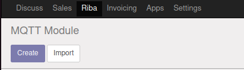

<a name="readme-top"></a>

<!--
HOW TO USE:
This is an example of how you may give instructions on setting up your project locally.

Modify this file to match your project and remove sections that don't apply.

REQUIRED SECTIONS:
- Table of Contents
- About the Project
  - Built With
  - Live Demo
- Getting Started
- Authors
- Future Features
- Contributing
- Show your support
- Acknowledgements
- License

OPTIONAL SECTIONS:
- FAQ

After you're finished please remove all the comments and instructions!
-->

<div align="center">
  <!-- You are encouraged to replace this logo with your own! Otherwise you can also remove it. -->
  
  <br/>

  <h3><b>Python MQTT Module Odoo</b></h3>

</div>

<!-- TABLE OF CONTENTS -->

# 📗 Table of Contents

- [📖 About the Project](#about-project)
  - [🛠 Built With](#built-with)
    - [Tech Stack](#tech-stack)
    - [Key Features](#key-features)
- [💻 Getting Started](#getting-started)
  - [Setup](#setup)
  - [Prerequisites](#prerequisites)
  - [Install](#install)
  - [Code](#code)
  - [Run tests](#run-tests)
- [👥 Authors](#authors)
- [🙏 Acknowledgements](#acknowledgements)
- [📝 License](#license)

<!-- PROJECT DESCRIPTION -->

# 📖 **Python MQTT Module Odoo** <a name="about-project"></a>

What we have done in this project is to create a module for Odoo10 in Python that takes data from the Sales module and implements MQTT to have a messaging protocol between devices.

For all this, we have an Odoo inside a Docker and what we do is edit the module and then copy it to Docker, but it can be done without Docker, the only thing that changes is that every time we edit the module, we have to copy it to the Docker.

## 🛠 **Built With** <a name="built-with"></a>

### **Tech Stack** <a name="tech-stack"></a>

<details>
  <summary>Docker</summary>
  Docker is a container-based virtualization platform that enables you to package and distribute applications efficiently and on the go. It provides an easy and consistent way to manage applications and their dependencies, making it easy to deploy and run in different environments.
  <ul>
    <li><a href="https://www.docker.com/">Docker</a></li>
  </ul>
</details>

<details>
  <summary>Odoo 10</summary>
  Odoo is an open source business software that integrates different modules for business management, including sales, accounting, inventory, human resources, and more, all in a single platform.
Odoo allows companies to automate and improve their business processes, providing a complete and customizable solution for different areas of the company.
  <ul>
    <li><a href="https://www.odoo.com/">Odoo</a></li>
  </ul>
</details>

<details>
<summary>Mosquitto</summary>
Mosquitto is an open source MQTT (Message Queuing Telemetry Transport) broker that facilitates communication between devices in wide area networks and Internet of Things (IoT) environments, allowing the publication and subscription of messages in different topics (topics) of efficient and reliable way.
  <ul>
    <li><a href="https://mosquitto.org/">Mosquitto</a></li>
  </ul>
</details>

<!-- Features -->

### **Key Features** <a name="key-features"></a>

- **Odoo module creation**
- **Communication between Odoo and Mosquitto**
- **Sending messages by MQTT**

<p align="right">(<a href="#readme-top">back to top</a>)</p>

<!-- GETTING STARTED -->

## 💻 Getting Started <a name="getting-started"></a>

### **Prerequisites**

#### <u>**Docker**</u>

1. First of all, install docker to be able to run Odoo inside:

```
 sudo apt install docker-ce docker-ce-cli containerd.io
```

2. Verify that Docker has been installed correctly:

```
docker --version
```

3. Docker would already be installed

#### <u>**Odoo v.10**</u>

1. To install Odoo, download two Odoo images:

```
# Postgres Database
    sudo docker run -d -v odoo-db:/home/alumne/volumsDocker/postgresql/data -e POSTGRES_USER=odoo -e POSTGRES_PASSWORD=odoo -e
# Odoo Image
    sudo docker run -v odoo-data:/home/alumne/volumsDocker/odoo -d -p 8069:8069 --name odoo --link db:db -t odoo:10
```

<p>
    <b>IMPORTANT:</b> It is necessary to change the path and adapt it to your system
</p>
To check if containers have been downloaded correctly, run this command and you have to see 2 containers.

```
docker container ls --format "table {{.ID}}\t{{.Names}}\t{{.Ports}}" -a
```

2. Start the containers, the DB first:

```
# Start DB
    sudo docker start db
# Start Odoo
    sudo docker start odoo
```

3. Once everything is installed and started, Odoo can be accessed through the default Odoo (8069). Open the browser and access:

```
http://localhost:8069
```

4. As you can see, Odoo is installed:

<p align="center">
    
</p>

5. Fill in the form to create the database, the admin email and the admin password.

6. When seeing the app menu, we will already be inside Odoo with the Admin user.

#### <u>**Mosquitto**</u>

1. To install Mosquitto, it has to be done inside the Odoo-data container. To access with a bash inside the container, it is done with the command:

```
 sudo docker exec -it -u root odoo /bin/bash
```

2. It's necessary to install Python dependencies to run Mosquitto correctly:

```
apt-get update
apt-get install -y python-dev
apt-get install -y python-pip
apt-get install -y gcc
apt-get install -y libssl-dev
```

3. Now, we can install the MQTT with pip install:

```
pip install paho-mqtt
```

4. To finish the installation process, we restart the Odoo service:

```
service odoo restart
```

### **Setup**

To configure this module in Odoo, follow these steps:

1. To install modules in Odoo, it is necessary to activate the Developer Mode. For this, in the top menu, click on "Settings" > "Activate the developer Mode".

<p align="center">
  
</p>

2. In a new terminal (outside docker bash), in the directory where the module folder is located to implement it in Odoo, we copy the folder inside Docker to the directory where all the modules are located:

```
sudo docker cp module odoo:/usr/lib/python2.7/dist-packages/odoo/addons/
```

3. When the module is copied to Docker, update the app list to show the new module.

<p align="center">
  
</p>

4. If you don't see the module in the Apps menu, log out and log in again, it should already be displayed.

<p align="center">
  
</p>

5. Once the module is installed, in the upper browser you can see the module and you can enter.

<p align="center">
  
</p>

6. When entering the module, you can see the Create button to send MQTT messages with data from the Sales module.

<p align="center">
  
</p>


El hijo del naranjo,

<!--
Example commands:

```sh
  cd my-folder
  git clone git@github.com:myaccount/my-project.git
```
--->

### **Code**

Now we are going to analyze the code a bit and find out what variables have to be changed to adapt it to any situation. To adapt the code you have to change the Broker's IP, the port, the topic and the message. All the code is in **module/models/models.py**.<br>
Things to change:
<ul>
  <li>Broker IP: "192.168.204.110"</li>
  <li>Port: 1883</li>
  <li>Topic: "Microdesys/f/m1command"</li>
  <li>Message: "m1reset", "m1start"</li>
</ul>
You have to change only this tings if for example you want to edit the message or the port. You open the file and search with the data in the list and replace it.

What has been done is to take all the sales and import them into the new module with these first lines of the SaleOrder class. What is done is to create a relationship with the Sales module thanks to Many2one.
```
sale_order_id = fields.Many2one('sale.order.line', string='Sale Order')
product_count = fields.Float(string='Product Count', related='sale_order_id.product_uom_qty', readonly=True)
state = fields.Integer(string='state')
```
And all the functions below are the functions that we send to the machine by mqtt message. It depends on the message that is sent, the machine does one thing or does another. For example, if the machine receives an "m1start", it starts production. What we have done is:
<ul>
  <li>m1start -> The machine starts</li>
  <li>m1stop -> The production stops</li>
  <li>m1reset -> The machine is restarted</li>
  <li>m1produce -> The machine starts producing</li>
  <li>m1produce02 -> The machine produces X units</li>
</ul>

Obviously, the machine has to be subscribed to the broker and in the topic where the messages are sent. Otherwise, being in a different broker or topic, the messages will be sent but will not reach the subscriber.

### **Run tests**

Now we are going to do a test, we are going to create a Sale from the Sales module and we will go to our module to see if everything is related correctly.

First of all we go to the Sales module to create the sale, for that we click on the "Create" button.

<p align="center">
  
</p>

The command template comes out and we fill it in with the necessary data. For example, we make a 18 units of the product we have created "TESTPRODUCT". And to save it, click on the left top button "Save".

<p align="center">
  
</p>

The Sale is already created, now we go to the module that we have made and click on the "Create" button.

<p align="center">
  
</p>

In the select menu of Sale Order, if we click we can see the TESTPRODUCT and if we select it the Product Count change to 18, the quantity in the Sale we've done before.

<p align="center">
  
</p>

In the navbar you can see all the actions you can send to the machine. It works only if all are configured correctly and the machine understands the messages.

<p align="right">(<a href="#readme-top">back to top</a>)</p>

<!-- AUTHORS -->

## 👥 Authors <a name="authors"></a>

👤 **Riba00**

- GitHub: [@Riba00](https://github.com/Riba00)
- Twitter: [@Riiba00](https://twitter.com/Riiba00)
- LinkedIn: [Jordi RF](https://www.linkedin.com/in/jordi-rf/)

👤 **Alejop88**

- GitHub: [AleixCarles](https://github.com/AleixCarles)
- Twitter: [Aleix_Carles_](https://twitter.com/Aleix_Carles_?t=LqOuCPajQ6KAyeYsyUNI6w&s=09)
- LinkedIn: [Aleix Carles Santús](https://www.linkedin.com/in/aleix-carles-sant%C3%BAs-967199267/)

👤 **AMS**

- GitHub: [AleixMS5](https://github.com/AleixMS5)
- Twitter: [Ams__13](https://twitter.com/Ams__13)
- LinkedIn: [Aleix Montero Sabaté ](https://www.linkedin.com/in/aleix-montero-sabat%C3%A9-3796a4202/)

👤 **JBayo**

- GitHub: [@JoanBayo](https://github.com/JoanBayo)
- Twitter: [@joanbayo_](https://twitter.com/joanbayo_)

<p align="right">(<a href="#readme-top">back to top</a>)</p>

<!-- ACKNOWLEDGEMENTS -->

## 🙏 Acknowledgments <a name="acknowledgements"></a>

I want to express my sincere thanks to everyone involved in this project. Your dedication, experience and commitment have been fundamental to the success of this project. Thank you for your hard work, patience and for bringing our ideas to reality. I am sincerely impressed and grateful for your exceptional work. It is a real pleasure to work with such a talented and professional team!

<p align="right">(<a href="#readme-top">back to top</a>)</p>

<!-- FAQ (optional) -->

<!-- LICENSE -->

## 📝 License <a name="license"></a>
<a rel="license" href="http://creativecommons.org/licenses/by-sa/4.0/"></a><br />This work is under <a rel="license" href="http://creativecommons.org/licenses/by-sa/4.0/">Creative Commons License Atribución-CompartirIgual 4.0 Internacional</a>.

<p align="right">(<a href="#readme-top">back to top</a>)</p>
